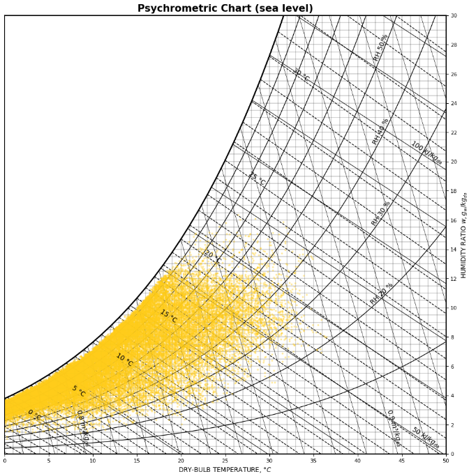

## Calculate Enthalpy

You have weather data and need to evaluate the corresponding **Enthalpy**? Then check out [CalculateEnthalpy.py](CalculateEnthalpy.py)!

In the *main* function, specify path to weather data and column names for *air temperature*, *relative air humidity* and *air pressure*. Or use the default example with data from [weather_data.csv](weather_data.csv). Then, let the code run
  

**How does the code work?**

Enthalpy is dependent on `air temperature`, `relative air humidity` and `air pressure`. Therefore, the code uses those measures for calculation. Moreover, different formulas are applied for *unsaturated*, *saturated* and *oversaturated* air. For this, corresponding *saturation vapor pressure* and the *air water content* are looked up in a [`saturation table`](saturation_table.xlsx) to be finally used for the enthalpy calculation.
  

**Psychrometric Chart**

*Temperature* and *Humidity* are typically visualized in a Psychrometric Chart. [PsychrometricChart.ipynb](PsychrometricChart.ipynb) provides the corresponding code.

