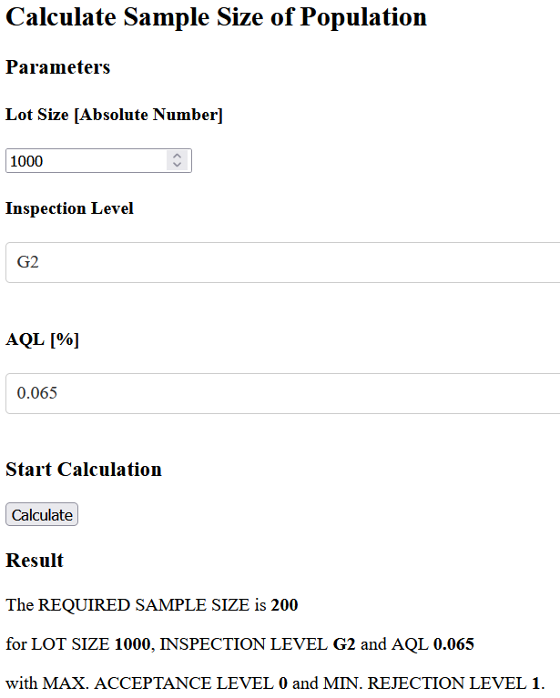

## Calculate Sample Size of a Lot using *AQL*

You need to inspect a product lot and don't know how many samples you should check on? Then try out the **Acceptable Quality Limit (AQL) Calculator**! It will tell you the *Sample Size* as well as the *Maximum Acceptable Level* and the *Minimum Rejection Level* for defects within this sample size.

The acceptance sampling system for inspection is described in DIN ISO 2859-1.  
AQLs are usually agreed with the supplier.  
There are 7 Inspection Levels available: 3 general (G1-G3) and 4 special ones (S1-S4). The general ones are usually defined as follows:
- critical defects (0% level): potential hazard to the end user
- major defects (2.5% level): product potentially unusable
- minor defects (4.0% level): potentially restricted usability.
For further information please check on [wikipedia](https://en.wikipedia.org/wiki/Acceptable_quality_limit) or other (web) sources.

This project was designed to build a sample size calculator as Web App. For this, [plotly Dash](https://plotly.com/dash/) was used. The app provides an input field for  `Lot Size` as well as dropdown menus for the desired `Inspection Level` and  `AQL (Acceptable Quality Limit)`. The calculation is executed by clicking on the *Calculate* button.

[frontend_dash.py](frontend_dash.py) contains the code for web app layout and functionality. This file calls a class in [calculateSampleSize_aql.py](calculateSampleSize_aql.py) for `Sample Size` lookup.

#### Layout 

