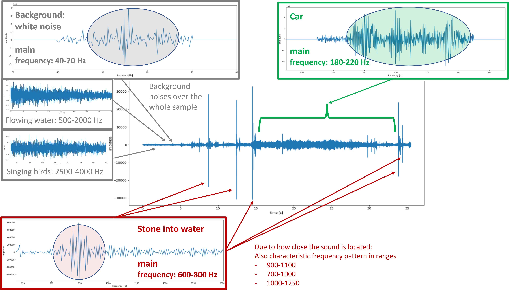

## Pattern Recognition in Audio Signals

For this project, an [audio file](StonesIntoRiverNextToRoad.wav) was analyzed which contains noises of *stones being thrown into water*, *birds chirping* as well as *cars passing by*.  

For each of those three noises, corresponding sequences were analyzed individually in [patternsInAudioSignals.ipynb](patternsInAudioSignals.ipynb) via
- amplitude over time
- correlation over time
- frequency over time (*spectrogram*)

By this, the corresponding frequencies could finally be assigned to the complete audio sample as demonstrated in here:

