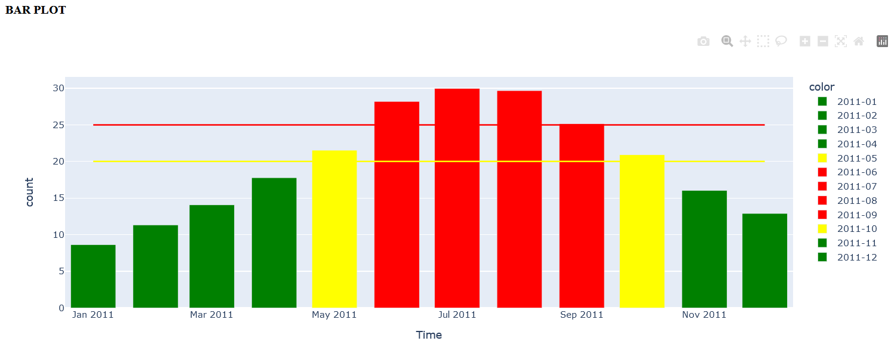

## COLORED BARPLOT - based on Thresholds

To monitor monthly aggregated data, user-defined thresholds can be used. Data is colored as traffic lights.

As a front end, [plotly Dash](https://dash.plotly.com/) was used. For details, please refer to [barplot.py](barplot.py).

Code for coloring due to thresholds is available in [barPlotRules.py](barPlotRules.py).

#### Layout

