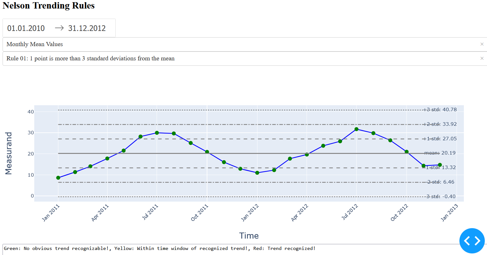

## PROCESS MONITORING according to NELSON TRENDING RULES

The eight [Nelson Trending Rules](https://en.wikipedia.org/wiki/Nelson_rules) can be applied to check whether a measured variable is *out of control*.

Those rules were coded together with corresponding assignment of *traffic lights* in [TrendingRules.py](TrendingRules.py). The code allows to easily adapt the Trending Rules towards your needs. By this, it is possible to e.g. change Rule 3 to 4 instead of 6 data points in a row increasing or decreasing to assign a trend.

As a front end, [plotly Dash](https://dash.plotly.com/) was used. For details, please refer to [Lineplot_coloredBasedOnCondition.py](Lineplot_coloredBasedOnCondition.py). The web app allows to select the time window of interest as well as the trending rule. Moreover, helper lines for mean and &plusmn;  1, 2, 3 standard deviations are being displayed together with the respective values. The data points are finally highlighted in the corresponding traffic light colors.

Please note, that for this example, data from [kaggle](https://www.kaggle.com/c/bike-sharing-demand/data) was used!
