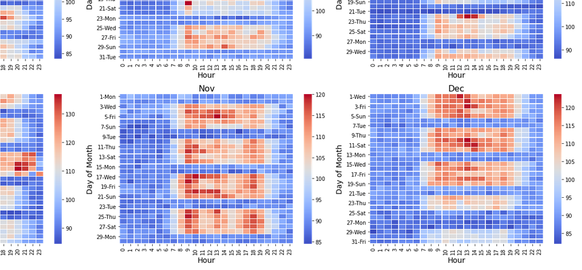
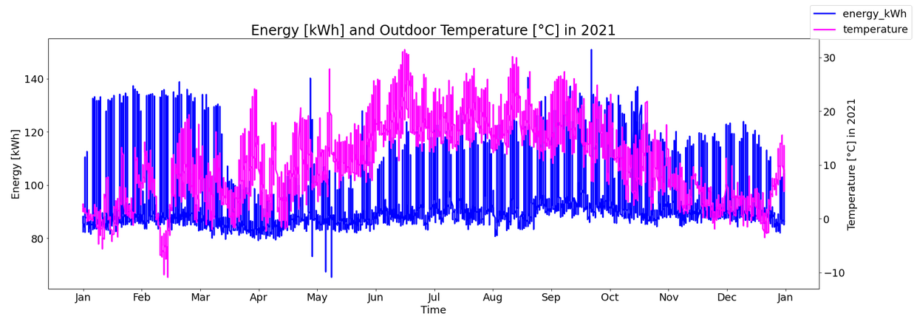

## HEATMAPS & LINEPLOTS

In order to get insights into *Energy Consumption*, heatmaps and lineplots were created. [powerPeaks_createPlots.py](powerPeaks_createPlots.py) contains all the code details. [PowerPeaks.ipynb](PowerPeaks.ipynb) finally demonstrates how the plots look like, also in terms of
- *normalization* (color coding of energy consumption within a year or per month)
- *differentiation* (to approach stationarity of the time series).

Here, you can get a first glimps of the two plot types for the topic *energy consumption*:

#### Heatmaps
This graph consisting of 12 subplots (1 per month) comprises data of a whole year. The heatmaps allow to easily grasp on which weekdays per month and at which hour per day most energy was consumed.

#### Lineplots
Laying data points of energy consumption and temperature on top of each other, allows for initial insights on data movement.
This plot can also be created for both *differentiated* time series.

Please be aware, that the constant energy consumption of always running systems (e.g. for fridges) might need to be substracted first (if movement of decreasing temperature with increasing energy consumption is of major interest).

