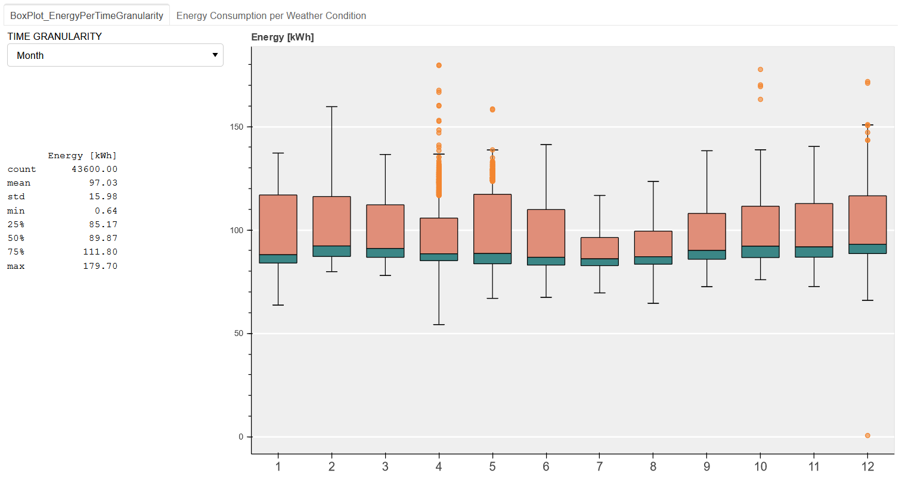
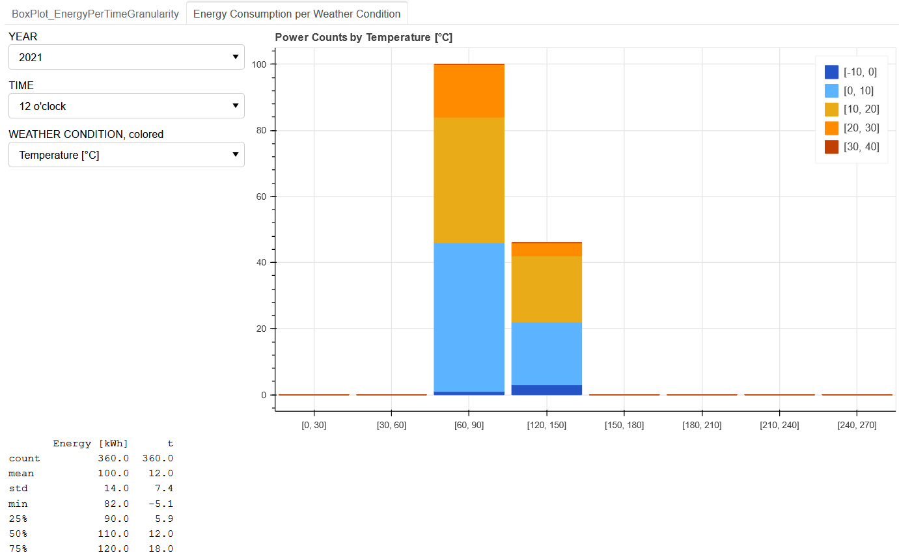

## BOKEH Web App

This web app was built with [Bokeh](https://bokeh.org/).

For details on how to start the web app, please refer to [HowToStartBokehWebApp.txt](HowToStartBokehWebApp.txt). By following the instruction, [main.py](main.py) is automatically called, which again calls [scripts/boxPlot.py](scripts/boxPlot.py) and [scripts/barPlot.py](scripts/boxPlot.py)

The web app contains two tabs to show *boxplot* and *stacked bar plot* for the topic *energy consumption*. Both tabs contain drop down menus and descriptive statistics being displayed on the left side.

#### Boxplot
Boxes are being displayed for the time granularity that was chosen in the drop down menu.

  

#### Stacked Bar Plot
Temperature ranges of the energy bins are colored differently.

 

Please note that synthetic data was used for demonstration purpose.
