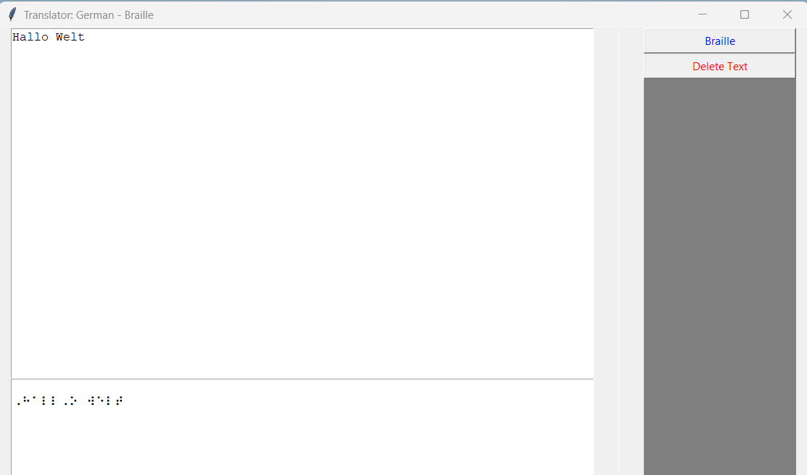

## Translate German Writing to Braille Symbols
This project came into being when I got in contact with Braille by chance during vacation. Not knowing too much about it, I decided to build a translator for German language to Braille symbols. Each symbol can typically be displayed by a matrix of 3 rows and 2 columns of which the fields are occupied or not. For the non-blind people, this is usually being displayed as black dots on white background, while the blind people rather rely on the haptic version.

#### Approach 1) Arrays
By a **3x2 matrix**, only 2^6 characters can be encoded, so that Braille symbols can also be displayed in a **4x2 matrix** in order to cover a larger variety of letters and special characters.

[braille_viaArrays.py](braille_viaArrays.py) offers the possibility to translate either to 3x2 or to a 4x2 matrix. The console output displays the Braille symbols as arrays of 0s and 1s. Not the best readable for both, non-blinds and blinds, but containing the logic as basis (to be connected to corresponding hardware) for haptic output.

#### Approach 2) Unicode
Braille symbols are available as Unicode symbols (U+2800 to U+28FF). A Unicode Braille symbol is not necessarily transferable into another language (e.g. compare Latin vs Japanese alphabet or letters like "ö", "é", etc.).

Also for **double or triple sounds** like the German "au", "ie" or "sch" there exist single Braille symbols so that there is no need to code each letter separately. The respective code is available as [braille_viaUnicode.py](braille_viaUnicode.py). This script could be run separately to obtain the Braille symbols as console output. However, it is also connected to the **translator app** [gui.py](gui.py), which was built with *tkinter*. This app does not contain haptic components but allows non-blinds to get familiar with Braille. This app contains a field for letter input, a field for Braille character output. It also contains the buttons *Braille* to start the translation and *Delete* to delete the letter input and output fields in order to start a new translation.

