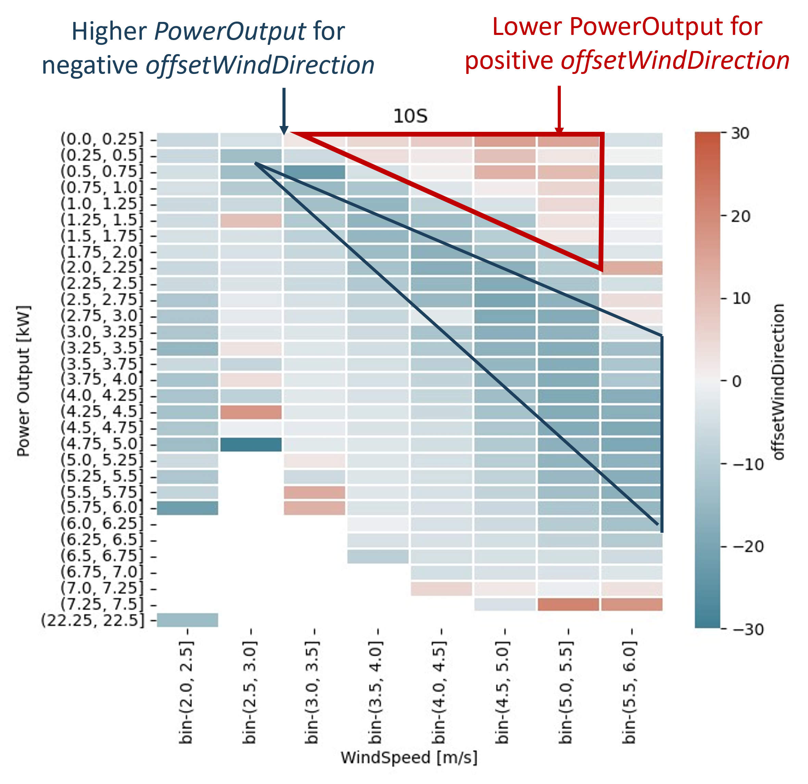
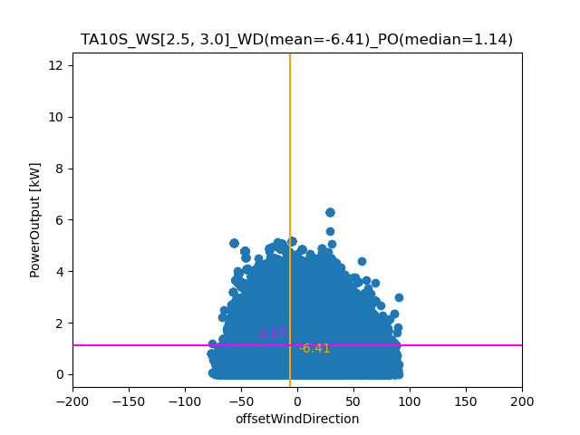
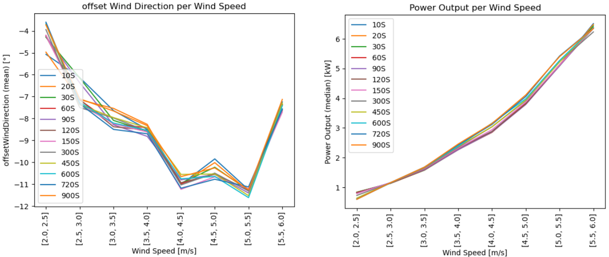
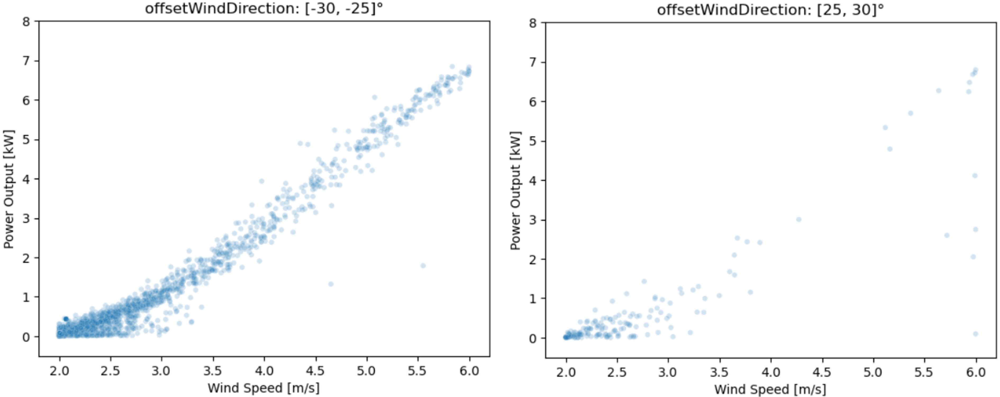

## STATIC YAW MISALIGNMENT of WIND TURBINES

This project was started at the [*Energy Data Hackdays*](https://energydatahackdays.ch) in September 2023 in Switzerland and continued privately afterwards. It relates to the topic [*Identifying static yaw misalignment of wind turbines*](
https://hack.energy.opendata.ch/project/10).

Before this project started, nothing was known to me on this topic. Therefore, different approaches on *Exploratory Data Analysis* were tried to get familiar with the data. As the number of plots increased, functions for heatmaps and scatter plots were outsourced to [toolbox.py](toolbox.py). Running this script created various plots on different time window aggregations. This was tried, because the amount of data should be kept small in order to reduce computational effort.

#### Heatmaps
Heatmaps were created by running [toolbox.py](toolbox.py). Heatmaps on different time aggregations showed similar patterns for windspeed > 2.5 m/s: For slight positive *offsetWindDirection*, lower *PowerOutput* was detected, while negative *offsetWindDirection* tended to higher *PowerOutput*. These findings imply a potential misalignment. Moreover, the zero *offsetWindDirection* was found for lower *WindSpeed* and higher *PowerOutput*.
An exemplary heatmap is represented in the following.

#### Scatterplots
In parallel to the heatmaps mentioned above, also scatterplots were created by running [toolbox.py](toolbox.py). Each scatterplot refers to a different *WindSpeed* bin. Of each plot, mean *offsetWindDirection* (orange) and median *PowerOutput* (magenta) were evaluated. An example scatterplot is demonstrated in the following:

From all of these plots, the mean *offsetWindDirection* values were transferred to a table, which was used to assess the best time window for aggregation. A similar approach was applied to median *PowerOutput*. The assessment was performed visually for both constellations (see plots below).
Based on both plots, tremendous differences could not be evaluated between different time aggregations, so that only one time window (300S) was used for further analyses.

However, the plots show different *offsetWindDirections* for different *WindSpeed* intervals. The highest negative values for *WindSpeeds* were found between 4.0 and 5.5 m/s, while the effect was found to be lower for windspeed > 5.5 m/s. Median *PowerOutput* increased as expected with higher *WindSpeed* but shows a slight exponential growth.

#### Further Analysis
As mentioned above, a time aggregation of 300s was used for further analyses. Moreover, *offsetWindDirection* between -30 and +30 degrees were selected as these contained most of the data. *PowerOutput* vs *WindSpeed* was plotted for different *offsetWindDirection* bins. For *offsetWindDirection* of e.g. [-30, -25]°, higher counts were observed as for [+25, +30]° (see image below), which implies potential yaw misalignment.

Therefore, *PowerOutput* was finally plotted against the *offsetWindDirection* and the median was evaluated for all *WindSpeeds* at about **-6 degrees** for the whole range of 0-7 kW *PowerOutput* (see plot below).

However, for a more precise yaw adjustment, the lineplot (on different time windows for aggregations, *offsetWindDirection* vs *WindSpeed*, see above) should be considered. Moreover, plots on different *PowerOutput* bins vs *offsetWindDirection* might provide more precise insights.

For details please refer to [analysis.ipynb](analysis.ipynb).

#### Data Source
At the [*Energy Data Hackdays*](https://energydatahackdays.ch), data was provided as parquet file.
However, similar data is available on [Zenodo](Zenodo.org) for wind turbines
- https://zenodo.org/records/8223010
- https://zenodo.org/records/8192149
- https://zenodo.org/records/8252025
- https://zenodo.org/record/8253010
